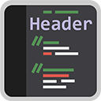
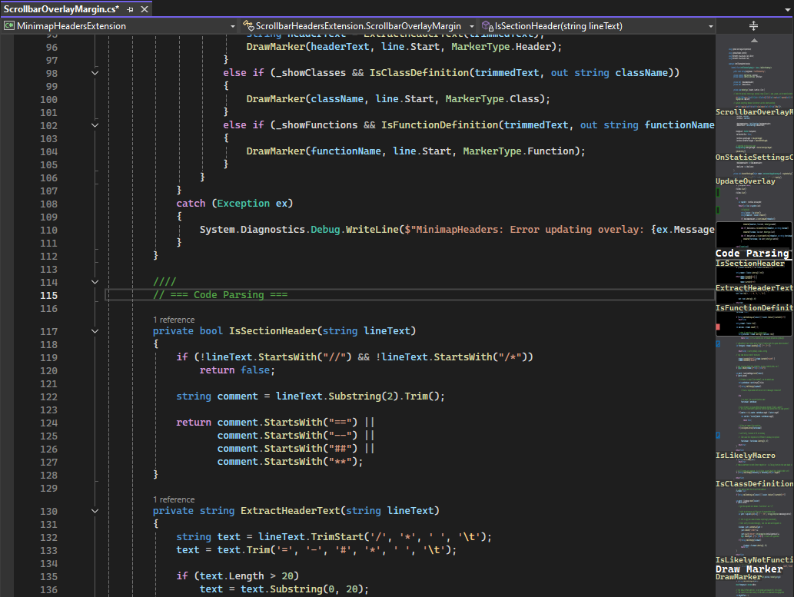

# Minimap Headers
### Visual Studio 2022/2026 extension that can display code structure overlays on the minimap scrollbar

_Optionally_ shows:
- **Comment "headers"** - lines starting with _at least 2_ of `==`, `--`, `##`, or `**`, eg `// ==== Header Name ====`
- Parsed function names (automatic, C++ & C# supported)
- Class and struct definitions
- Access specifiers - pub, prot, priv, etc

Inspired by the comment headers in VSCode that I always wanted in VS!

## Settings

Configure what's displayed via **Tools > Options > Minimap Headers > General**

## Installation

Marketplace version coming soon :tm: when I am happy that this is robust enough, especially the parser.

Installing it yourself should be as easy as building the .sln (see below).

Tested on VS2022 Community and VS2026 Insider's Edition.

This should support all other VS2019, VS2022, VS2026 targets, but flag an issue if not.

## Building

1. Open `MinimapHeadersExtension.sln` in Visual Studio and build in **Release** mode (for installing to VS, use **Debug** if changing anything).
2. The VSIX will output to either `bin/Debug` or `bin/Release`, double click it and it'll open the installer to add this to VS2022.
3. That's it, it will appear in the _Installed_ extensions section like any other extension if you wish to remove.

## Licence
[LICENCE](LICENCE)
